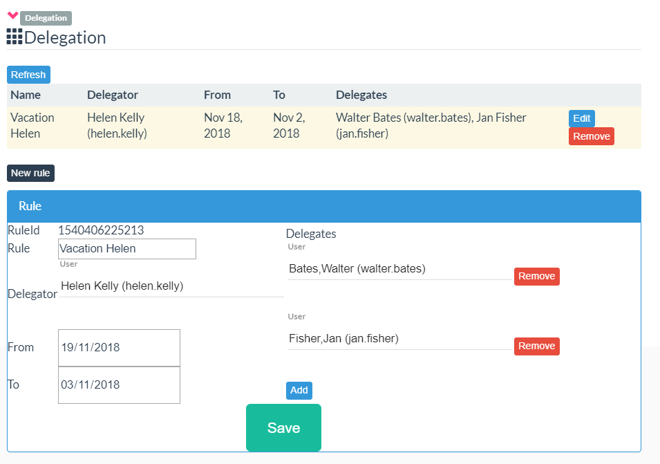

# page_sweetvehicule / Delegation

This page manage the delegation.

 

Only person registered in the Administrator profile can create a new delagation rule. A delegation rule contains:
* the user who delegate the task
* the list of delegator users. All theses users will see tasks
* a period. A period means the delegation is activate only during this period. You can miss one date (for example, no end date) : in this cirsconstance, there are no limitation for the delagation in time

 

User can then see all task. Its task, or all tasks of the user. Attention, a task ASSIGNED to the user is not visible by this mechanism, in order to protect the assignement mechanism.
